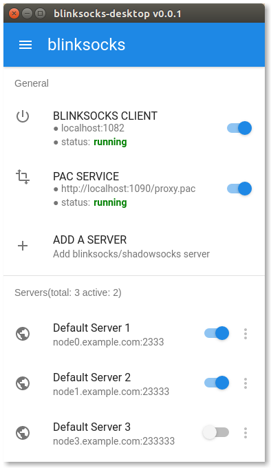
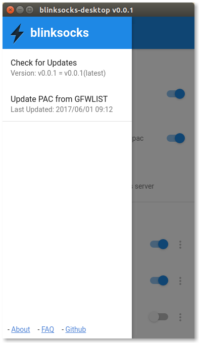
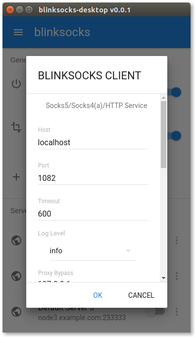
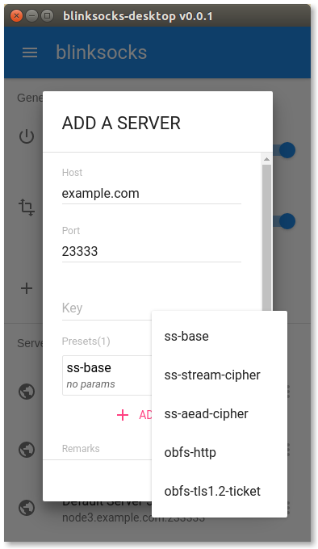

# blinksocks-desktop

> The official GUI for [blinksocks].

## ScreenShots

## Features

* Cross-platform: Linux, Windows and macOS, ia32/x64
* Portable: no installation and other requirements
* Integrate blinksocks and local PAC service
* Incremental update
* Material UI

## Download

The latest build:

| Name                                           | SHA256  | Size    |
| :--------------------------------------------- | :------ | :------ | 
| [blinksocks-desktop-linux-ia32-v0.0.1.tar.gz]  | -       | - MB    |
| [blinksocks-desktop-linux-x64-v0.0.1.tar.gz]   | -       | - MB    |
| [blinksocks-desktop-win32-ia32-v0.0.1.tar.gz]  | -       | - MB    |
| [blinksocks-desktop-win32-x64-v0.0.1.tar.gz]   | -       | - MB    |
| [blinksocks-desktop-darwin-ia32-v0.0.1.tar.gz] | -       | - MB    |
| [blinksocks-desktop-darwin-x64-v0.0.1.tar.gz]  | -       | - MB    |

Looking for old versions? Please visit [releases].

## Documents

Please checkout [documents](docs).

## Contributors

See [authors](AUTHORS).

## License

Apache License 2.0

[blinksocks]:                                   https://github.com/blinksocks/blinksocks
[releases]:                                     https://github.com/blinksocks/blinksocks-desktop/releases
[blinksocks-desktop-linux-ia32-v0.0.1.tar.gz]:  https://github.com/blinksocks/blinksocks-desktop/releases/download/v0.0.1/blinksocks-desktop-linux-ia32-v0.0.1.tar.gz
[blinksocks-desktop-linux-x64-v0.0.1.tar.gz]:   https://github.com/blinksocks/blinksocks-desktop/releases/download/v0.0.1/blinksocks-desktop-linux-x64-v0.0.1.tar.gz
[blinksocks-desktop-win32-ia32-v0.0.1.tar.gz]:  https://github.com/blinksocks/blinksocks-desktop/releases/download/v0.0.1/blinksocks-desktop-win32-ia32-v0.0.1.tar.gz
[blinksocks-desktop-win32-x64-v0.0.1.tar.gz]:   https://github.com/blinksocks/blinksocks-desktop/releases/download/v0.0.1/blinksocks-desktop-win32-x64-v0.0.1.tar.gz
[blinksocks-desktop-darwin-ia32-v0.0.1.tar.gz]: https://github.com/blinksocks/blinksocks-desktop/releases/download/v0.0.1/blinksocks-desktop-darwin-ia32-v0.0.1.tar.gz
[blinksocks-desktop-darwin-x64-v0.0.1.tar.gz]:  https://github.com/blinksocks/blinksocks-desktop/releases/download/v0.0.1/blinksocks-desktop-darwin-x64-v0.0.1.tar.gz
