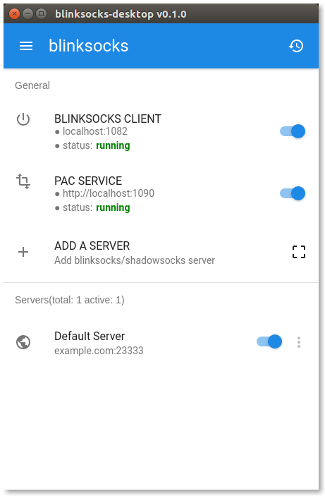
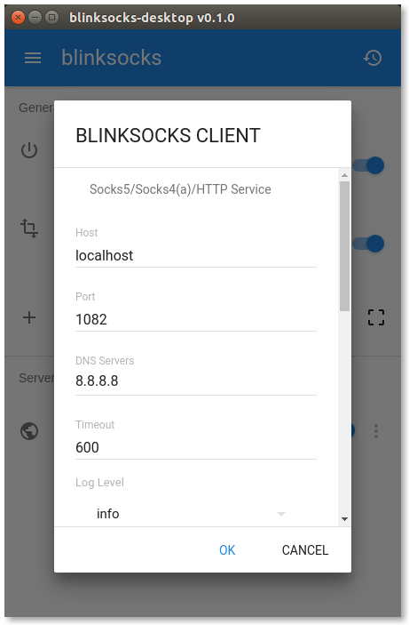
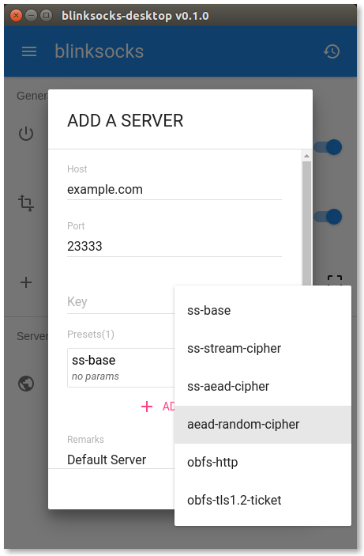
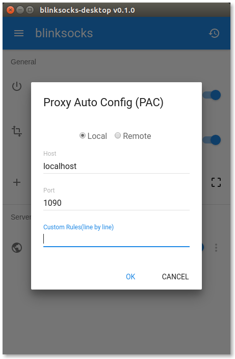
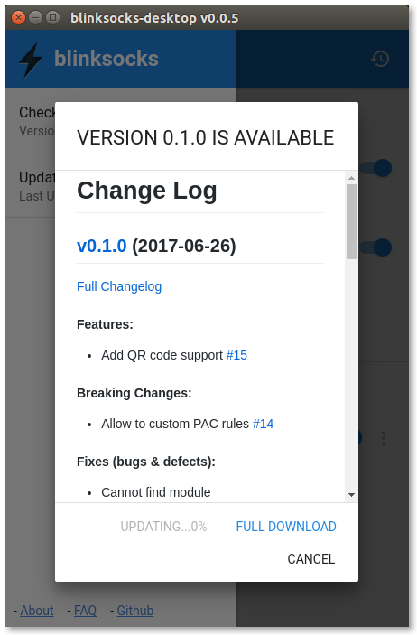

# blinksocks-desktop

> The official GUI for [blinksocks](https://github.com/blinksocks/blinksocks).

## Features

* Cross-platform: Linux, Windows and macOS, ia32/x64
* Portable: no installation and other requirements
* Integrate blinksocks and local PAC service
* Incremental update
* Material UI

## Links

* [Downloads](RELEASE.md): download the latest released binaries.
* [Documents](docs): usage and development guidance.

## ScreenShots

## Contributors

See [authors](AUTHORS).

## License

Apache License 2.0
