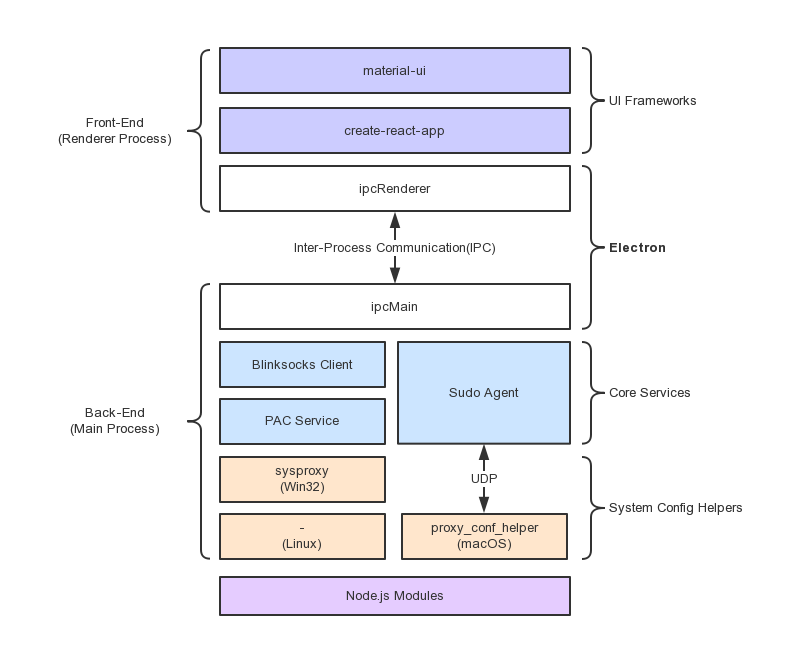

# Development

## Architecture

blinksocks-desktop is based on [Node.js](https://nodejs.org/en/) and [electron](https://electron.atom.io/).



## Requirements

We assume that your system has basic unix tools and shell environment.
Apart from that, you should have had the following tools installed:

* Node.js 6 or later
* OpenSSL
* gzip

## Quick Start

```
# Clone the repository
$ git clone https://github.com/blinksocks/blinksocks-desktop

# Go into the repository
$ cd blinksocks-desktop

# Install the dependencies and run
$ yarn install

# Start front-end development server
$ yarn start-dev

# Open a new terminal then start electron
$ yarn start-app
```

## Build for multiple platforms

```
# Compile front-end sources
$ yarn build

# Pack, generate patch, gzip then calculate sha256
$ yarn release
```

## Trouble Shooting

1. Install too slow and always fail.

Try to change npm registry and electron mirror to another one:

```
// ~/.npmrc
registry=https://registry.npm.taobao.org/
electron_mirror="https://npm.taobao.org/mirrors/electron/"
```
